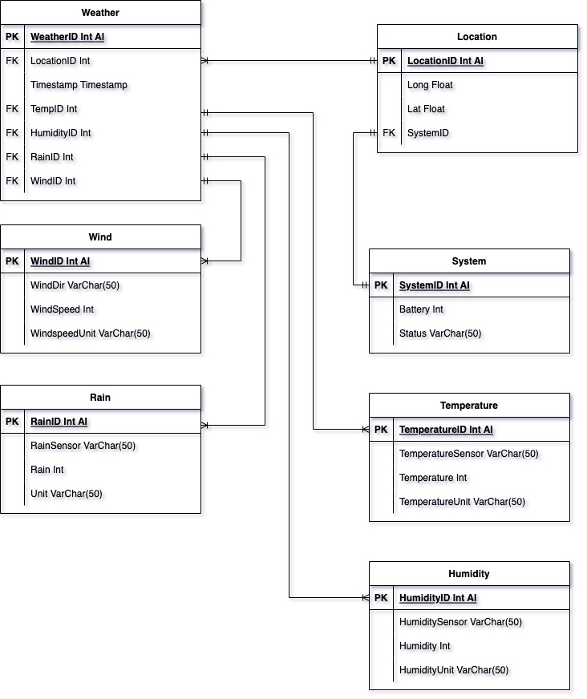

## How to install
```
pip install -r requirements.txt
apt install pijuice-base
apt install sqlite3
```

## Database
`sqlite` database with the following structure:



### Database dump

## How to run

Run the backend

```
python3 main.py
```
